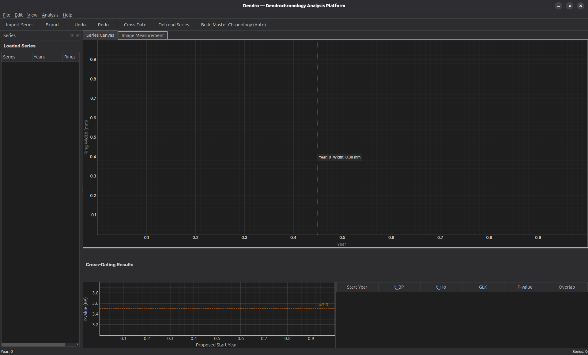

# Fritts — Dendrochronology Analysis Platform



An open-source desktop tool for tree-ring cross-dating, measurement, and master chronology building. Built with Python, PyQt6, and PyQtGraph. Named in honor of Harold C. Fritts, a pioneer of dendroclimatology.

**Repository**: [GitHub](https://github.com/mabo-du/fritts) · [GitLab](https://gitlab.com/mabodu/fritts)

---

## Table of Contents

- [Why Fritts?](#why-fritts)
- [Features](#features)
- [Installation](#installation)
- [Usage](#usage)
- [ITRDB Integration](#itrdb-integration)
- [Supported Formats](#supported-formats)
- [Project Structure](#project-structure)
- [Development](#development)
- [User Guide](#user-guide)
- [Target Users](#target-users)
- [Tech Stack](#tech-stack)
- [License](#license)

## Why Fritts?

Existing dendrochronology software is often dated, proprietary, Windows-only, or splits critical workflows across multiple applications. **Fritts** unifies format parsing, interactive visual plotting, statistical cross-dating, and chronology building into a single, modern, cross-platform interface.

## Features

- **Multi-format import** — Tucson (.rwl/.tuc), Heidelberg (.fh), TRiDaS XML
- **Interactive plotting** — PyQtGraph-powered canvas with smooth zoom, pan, and multi-series overlay
- **Statistical cross-dating** — Baillie-Pilcher t-value, Hollstein t-value, Gleichläufigkeit (GLK) with Buras-Wilmking 2015 correction
- **AI Image Segmentation** — DeepCS-TRD stub for automatic boundary detection
- **Regional Curve Standardisation (RCS)** — Advanced cambial-age detrending
- **COFECHA-Style Quality Control** — Sliding correlation reports for finding dating errors
- **Interactive Chronology Builder** — Real-time EPS and R-bar metrics while building your master curve
- **Geometric Pith Estimator** — Visual tool to estimate missing distances to the pith
- **Standard export** — Write to .rwl, .xml, and automatically generate R scripts (`dplR`)
- **ITRDB Search** — Search and download tree-ring data directly from the NOAA International Tree-Ring Data Bank

## Installation

```bash
# Clone the repository
git clone https://github.com/mabo-du/fritts.git
cd fritts

# Create a virtual environment (recommended)
python -m venv .venv
source .venv/bin/activate  # Linux/macOS
# .venv\Scripts\activate   # Windows

# Install in development mode
pip install -e ".[dev]"
```

### Dependencies

| Package   | Minimum Version | Purpose                        |
|-----------|-----------------|--------------------------------|
| PyQt6     | 6.6             | GUI framework                  |
| pyqtgraph | 0.13            | Interactive plotting           |
| pandas    | 2.1             | Data manipulation              |
| numpy     | 1.26            | Numerical computation          |
| scipy     | 1.12            | Statistical algorithms         |
| lxml      | 5.0             | XML parsing (TRiDaS format)    |
| torch     | 2.2             | AI image segmentation (stub)   |
| torchvision | 0.17          | AI image segmentation (stub)   |

## Usage

```bash
# Launch the application
fritts

# Or run directly
python -m dendro.main
```

### Quick Start

1. Launch Fritts from the command line.
2. Import ring-width data via **File > Import** (supports .rwl, .tuc, .fh, .xml).
3. Visualize your series in the interactive plot panel.
4. Run cross-dating analysis using **Tools > Cross-Date**.
5. Build a master chronology via **Tools > Build Chronology**.
6. Export results through **File > Export**.

### ITRDB Data Search

1. Open **Tools > Search ITRDB**.
2. Enter a search term (e.g., "oak", "colorado", "douglas fir").
3. Browse results and download matching .rwl series directly.
4. Imported data is immediately available for analysis.

## ITRDB Integration

Fritts connects to the [NOAA International Tree-Ring Data Bank](https://www.ncei.noaa.gov/products/paleoclimatology/tree-ring) (ITRDB) API to search and download tree-ring measurement series directly.

**Supported API features:**
- Keyword search across all published ITRDB studies
- Automatic detection of .rwl download URLs
- Direct import of series into the analysis workspace
- Graceful handling of missing metadata and network errors

**API endpoint**: `https://www.ncei.noaa.gov/access/paleo-search/study/search.json`

## Supported Formats

| Format       | Extensions        | Read | Write |
|--------------|-------------------|------|-------|
| Tucson Decadal | .rwl, .tuc, .crn | ✅   | ✅    |
| Heidelberg   | .fh               | ✅   | —     |
| TRiDaS       | .xml              | ✅   | ✅    |

## Project Structure

```
fritts/
├── assets/              # Static assets (screenshots, icons)
├── docs/                # Documentation
│   ├── USER_GUIDE.md    # End-user documentation
│   ├── scope.md         # Project scope and roadmap
│   ├── research-papers/ # Reference papers
│   └── research-prompts/#
├── src/
│   └── dendro/
│       ├── io/          # Format parsers (Tucson, Heidelberg, TRiDaS, ITRDB)
│       ├── models/      # Data models (RingWidthSeries, etc.)
│       ├── stats/       # Statistical algorithms
│       ├── ui/          # PyQt6 interface components
│       └── main.py      # Application entry point
├── tests/               # Test suite (pytest)
├── pyproject.toml       # Build configuration
└── README.md
```

## Development

```bash
# Install with dev dependencies
pip install -e ".[dev]"

# Run tests
pytest

# Run linting
ruff check src/

# Format code
ruff format src/
```

### Contributing

1. Fork the repository on [GitHub](https://github.com/mabo-du/fritts) or [GitLab](https://gitlab.com/mabodu/fritts).
2. Create a feature branch from `master`.
3. Make your changes with tests.
4. Run the full test suite: `pytest`.
5. Submit a merge request / pull request.

## User Guide

See [docs/USER_GUIDE.md](docs/USER_GUIDE.md) for comprehensive documentation including:
- Installation troubleshooting
- Importing and exporting data
- Cross-dating workflows
- Chronology building
- ITRDB data search
- Interpreting statistical results

## Target Users

- Dendrochronologists dating archaeological timbers
- Climate researchers building proxy records from tree rings
- Wood specialists in archaeology and heritage

## Tech Stack

- **GUI**: PyQt6
- **Visualization**: PyQtGraph (75–150× faster than Matplotlib for interactive use)
- **Data**: Pandas, NumPy, SciPy
- **AI**: PyTorch
- **XML**: lxml

## License

MIT
